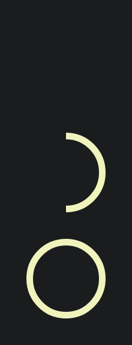

# ProgressIndicators components

## ProgressIndicator design specs

You can find the design specs
on [zeroheight.com/25c15666f/](https://zeroheight.com/25c15666f/p/54faa9-radio-button-/b/057def).

## Usage

Progress indicators displays the length of a process.

- Progress indicators look and animate in ways that reflect the status of a process. They are never
  simply decorative.
- Progress indicators use animation to capture attention and inform users of an activity’s progress
- Progress indicators should be applied to all instances of a process (such as loading) in a
  consistent format (linear or circular)

### LinearProgressIndicator

| Part Light                                                                                                                                                                  | Pro Light                                                                                                                                                                  | Part Dark                                                                                                                                                                  | Pro Dark                                                                                                                                                                  |
|-----------------------------------------------------------------------------------------------------------------------------------------------------------------------------|----------------------------------------------------------------------------------------------------------------------------------------------------------------------------|----------------------------------------------------------------------------------------------------------------------------------------------------------------------------|---------------------------------------------------------------------------------------------------------------------------------------------------------------------------|
|  |  |  |  |

```kotlin
@Composable
fun LinearProgressIndicator(
    progress: Float,
    modifier: Modifier = Modifier,
)

@Composable
fun LinearProgressIndicatorIndeterminate(
    modifier: Modifier = Modifier,
)
```

The minimal usage of the component is the progression but you can customize the size.

```kotlin
LinearProgressIndicator(
  modifier = Modifier.fillMaxWidth(),
  progress = 0f
)
LinearProgressIndicatorIndeterminate(modifier = Modifier.fillMaxWidth())
```

| Parameters                      | Descriptions                                                                                                                                                         |
|---------------------------------|----------------------------------------------------------------------------------------------------------------------------------------------------------------------|
| `progress: Float`               | the progress of this progress indicator, where 0.0 represents no progress and 1.0 represents full progress. Values outside of this range are coerced into the range. |
| `modifier: Modifier = Modifier` | to be applied to this progress indicator                                                                                                                             |

---

### CircularProgressIndicator

| Part Light                                                                                                                                                                    | Pro Light                                                                                                                                                                    | Part Dark                                                                                                                                                                    | Pro Dark                                                                                                                                                                    |
|-------------------------------------------------------------------------------------------------------------------------------------------------------------------------------|------------------------------------------------------------------------------------------------------------------------------------------------------------------------------|------------------------------------------------------------------------------------------------------------------------------------------------------------------------------|-----------------------------------------------------------------------------------------------------------------------------------------------------------------------------|
|  |  |  |  |

```kotlin
@Composable
fun CircularProgressIndicator(
  progress: Float,
  modifier: Modifier = Modifier,
)

@Composable
fun CircularProgressIndicatorIndeterminate(
  modifier: Modifier = Modifier,
)
```

The minimal usage of the component is the progression but you can customize the size.

```kotlin
CircularProgressIndicator(
  modifier = Modifier.fillMaxWidth(),
  progress = 0f
)
CircularProgressIndicatorIndeterminate(modifier = Modifier.size(48.dp))
```

| Parameters                      | Descriptions                                                                                                                                                         |
|---------------------------------|----------------------------------------------------------------------------------------------------------------------------------------------------------------------|
| `progress: Float`               | the progress of this progress indicator, where 0.0 represents no progress and 1.0 represents full progress. Values outside of this range are coerced into the range. |
| `modifier: Modifier = Modifier` | to be applied to this progress indicator                                                                                                                             |

