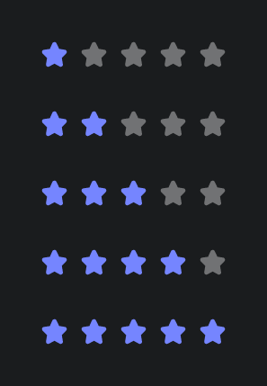
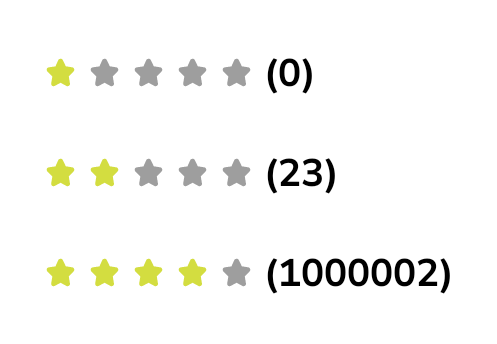
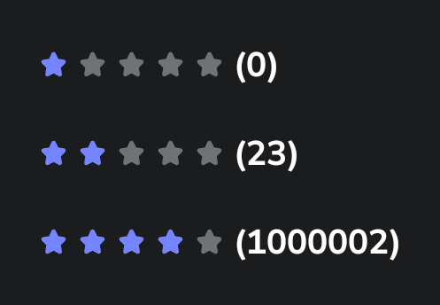

# Tags components

## Tags design specs

The rating element is essentially used to evaluate a product, service, or experience.

The value is the number of the rating selected, on a scale from 0 to 5.

The design specs are not yet available

## Usage

A rating is an element that allows to display a qualitative value.

### RatingSmall

| Part Light                                                                                                                                            | Pro Light                                                                                                                                            | Part Dark                                                                                                                                            | Pro Dark                                                                                                                                            |
|-------------------------------------------------------------------------------------------------------------------------------------------------------|------------------------------------------------------------------------------------------------------------------------------------------------------|------------------------------------------------------------------------------------------------------------------------------------------------------|-----------------------------------------------------------------------------------------------------------------------------------------------------|
|  |  |  |  |

```kotlin
@Composable
fun RatingSmall(
    @FloatRange(from = 0.0, to = 5.0)
    value: Float,
    modifier: Modifier = Modifier,
    nbComments: Int? = null,
)
```

The minimal usage of the component is the rating value between 0 and 5, you can also display the
total count of ratings associated with this rating.

```kotlin
RatingSmall(value = 3.0f)
RatingSmall(value = 3.0f, nbComments = 8)
```

| Parameters                      | Descriptions                             |
|---------------------------------|------------------------------------------|
| `value: Float`                  | the rating value included between [0..5] |
| `modifier: Modifier = Modifier` | to be applied to this rating             |
| `nbComments: Int? = null,`      | number of collected ratings              |

---

### RatingLong

#### RatingNaked

Component that displays rating of an user with only stars in the following form `*****`

| Part Light                                                                                                                                            | Pro Light                                                                                                                                            | Part Dark                                                                                                                                            | Pro Dark                                                                                                                                            |
|-------------------------------------------------------------------------------------------------------------------------------------------------------|------------------------------------------------------------------------------------------------------------------------------------------------------|------------------------------------------------------------------------------------------------------------------------------------------------------|-----------------------------------------------------------------------------------------------------------------------------------------------------|
|  |  |  |  |

```kotlin
@Composable
fun RatingNaked(
    @FloatRange(from = 0.0, to = 5.0)
    value: Float,
    modifier: Modifier = Modifier,
)
```

The minimal usage of the component is the rating value between 0 and 5.

```kotlin
RatingSmall(value = 3.0f)
RatingSmall(value = 3.0f, nbComments = 8)
```

| Parameters                      | Descriptions                                           |
|---------------------------------|--------------------------------------------------------|
| `value: Float`                  | rating value as a float, should be between 0.0 and 5.0 |
| `modifier: Modifier = Modifier` | to be applied to this rating                           |

---

#### RatingCompressed

Component that displays rating of an user with stars followed by the **nbComments** in the following
form `***** (5)`

| Part Light                                                                                                                                                 | Pro Light                                                                                                                                                 | Part Dark                                                                                                                                                 | Pro Dark                                                                                                                                                 |
|------------------------------------------------------------------------------------------------------------------------------------------------------------|-----------------------------------------------------------------------------------------------------------------------------------------------------------|-----------------------------------------------------------------------------------------------------------------------------------------------------------|----------------------------------------------------------------------------------------------------------------------------------------------------------|
|  |  |  |  |

```kotlin
@Composable
fun RatingNaked(
    @FloatRange(from = 0.0, to = 5.0)
    value: Float,
    modifier: Modifier = Modifier,
)
```

The minimal usage of the component is the rating value between 0 and 5.

```kotlin
RatingSmall(value = 3.0f)
RatingSmall(value = 3.0f, nbComments = 8)
```

| Parameters                      | Descriptions                                               |
|---------------------------------|------------------------------------------------------------|
| `value: Float`                  | rating value as a float, should be between 0.0 and 5.0     |
| `nbComments: Int`               | the nb of comments to be displayed after the rating stars. |
| `modifier: Modifier = Modifier` | to be applied to this rating                               |

---

#### RatingFull

Component that displays rating of an user with stars followed by the **nbComments** in the following
form `***** 5 avis`

| Part Light                                                                                                                                           | Pro Light                                                                                                                                           | Part Dark                                                                                                                                           | Pro Dark                                                                                                                                           |
|------------------------------------------------------------------------------------------------------------------------------------------------------|-----------------------------------------------------------------------------------------------------------------------------------------------------|-----------------------------------------------------------------------------------------------------------------------------------------------------|----------------------------------------------------------------------------------------------------------------------------------------------------|
|  |  |  |  |

```kotlin
@Composable
fun RatingFull(
    @FloatRange(from = 0.0, to = 5.0)
    value: Float,
    nbComments: Int,
    modifier: Modifier = Modifier,
)
```

The minimal usage of the component is the rating value between 0 and 5.

```kotlin
RatingSmall(value = 3.0f)
RatingSmall(value = 3.0f, nbComments = 8)
```

| Parameters                      | Descriptions                                               |
|---------------------------------|------------------------------------------------------------|
| `value: Float`                  | rating value as a float, should be between 0.0 and 5.0     |
| `nbComments: Int`               | the nb of comments to be displayed after the rating stars. |
| `modifier: Modifier = Modifier` | to be applied to this rating                               |
