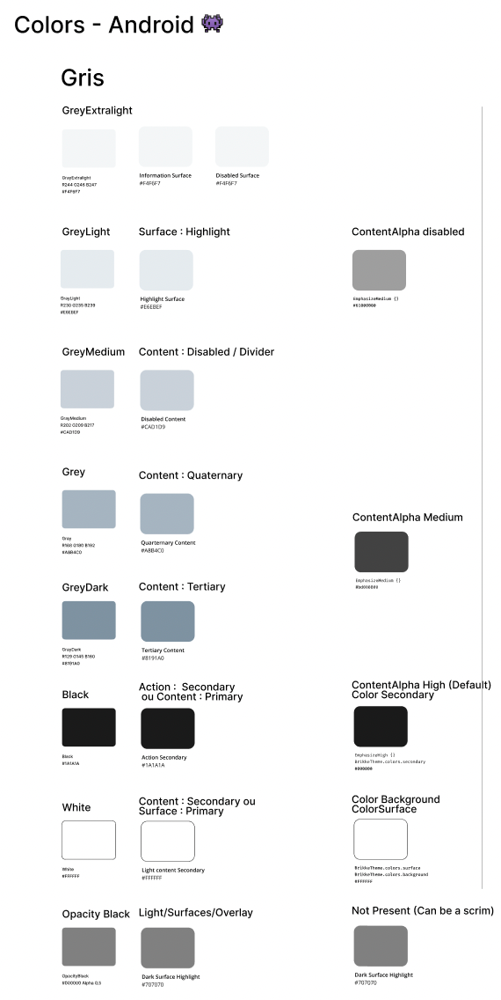
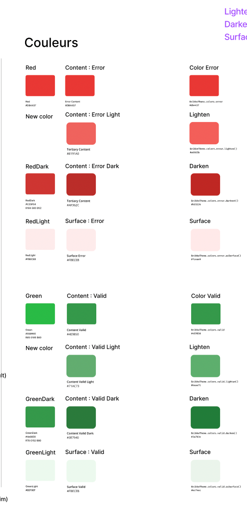
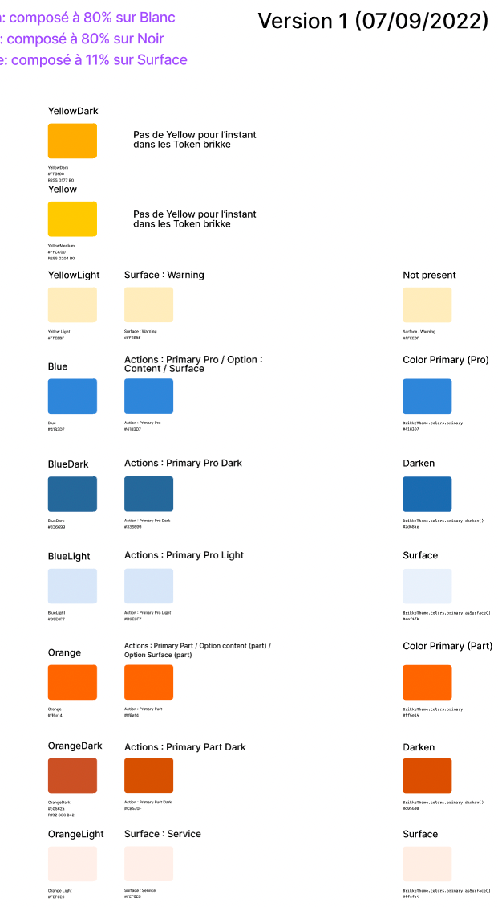

# Tokens

[//]: # (Lint to zeroheight + figma tokens here)

## Colors

[//]: # (Lint to zeroheight + figma colors here)

We have
a [Figma File](https://www.figma.com/file/NSXzrskbAYebc1RTQUgKYN/Color-Mapping?node-id=0%3A1) that
map the colors we can found in features Figma projects into which Composables/token we should use

<a href="https://www.figma.com/file/NSXzrskbAYebc1RTQUgKYN/Color-Mapping?node-id=0%3A1">
<p align="center">
  


</p>
</a>

### How to emphasize content

Emphasis is based on the docs
from [Android](https://web.archive.org/web/20211025084752/https://developer.android.com/jetpack/compose/themes/material#emphasis)
which use CompositionLocals under the hood

```kotlin
@Composable
fun EmphasePreview() {
    Column {
        Text("Uses MaterialTheme's provided alpha")
        EmphasizeHigh {
            Text("This Text uses the high value")
        }
        EmphasizeMedium {
            Text("Medium value provided for LocalContentAlpha")
            Text("This Text also uses the medium value")
            EmphasizeDisable {
                Text("This Text uses the disabled alpha now")
            }
        }
    }
}
```


## Elevation

[Figma](https://www.figma.com/file/E9JHa3rw9OYmZceSVHLPnN/Brikke---Tokens-%F0%9F%94%B6?node-id=203%3A72)
[ZeroHeight](https://zeroheight.com/25c15666f/p/380d82-shadows)

Just use default elevation when using Material Components other wise use closest to material
component

## Typography

[Figma](https://www.figma.com/file/E9JHa3rw9OYmZceSVHLPnN/Brikke---Tokens-%F0%9F%94%B6?node-id=890%3A90)
[ZeroHeight](https://zeroheight.com/25c15666f/p/73be39-typography/b/637f52)

Should be completely done

## Shapes

[ZeroHeight](https://zeroheight.com/25c15666f/p/448161-shapes)

Same as Material 2 but Brikke follow Material 3 so we need to change it to copy Material 3

