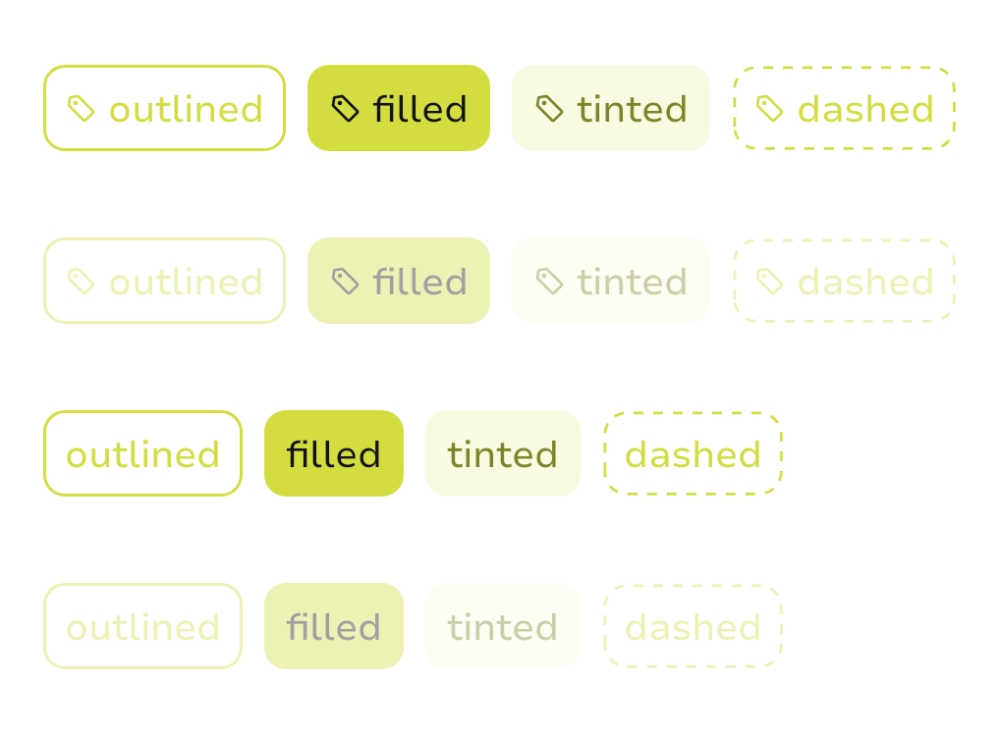
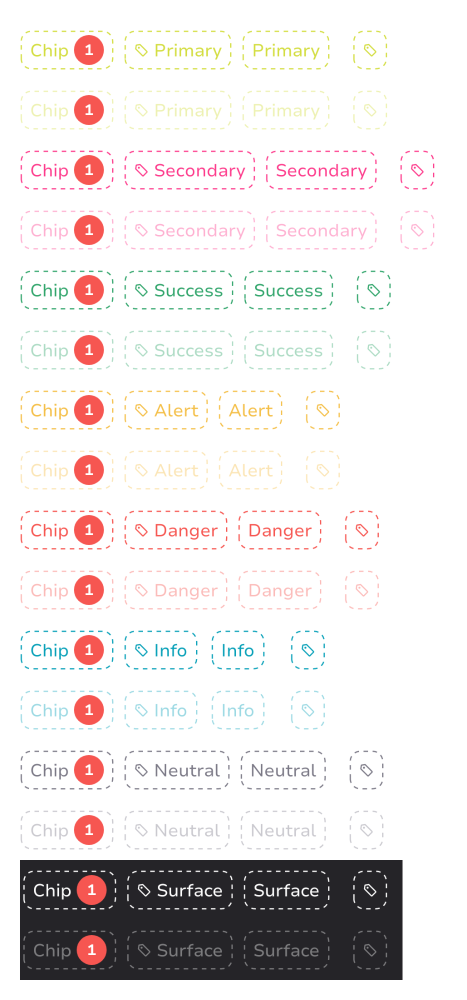

# Chip components

## Chip design specs

You can find the design specs
on [spark.adevinta.com](https://spark.adevinta.com/1186e1705/p/17568d-chip/b/98915d).

### Chip

Chips help users quickly recognize an important information that has been entered by them, 
trigger actions, make selections, or filter content.

|       | Part                                                                                                                                                                  | Pro                                                                                                                                                                  |
|-------|-----------------------------------------------------------------------------------------------------------------------------------------------------------------------|----------------------------------------------------------------------------------------------------------------------------------------------------------------------|
| Light |  |  |
| Dark  |   |   |

Most commonly chip contains an optional `leadingIcon` and the text.

### Styles

The chip can have one of the [ChipStyles](ChipStyles.kt):
- [Outlined](ChipOutlined.kt) - using a solid border stroke and no background
- [Filled](ChipFilled.kt) - using a solid color for the background
- [Tinted](ChipTinted.kt) - using one of the "containers" colors
- [Dashed](ChipDashed.kt) - using a dashed border and no background

The color is set using one of the [ChipIntent](ChipIntent.kt)s:
- Primary
- Secondary
- Success
- Alert
- Danger
- Info
- Neutral
- Surface

Part:
| Style    | Light                                                                                                                                                                         | Dark                                                                                                                                                                         |
|----------|-------------------------------------------------------------------------------------------------------------------------------------------------------------------------------|------------------------------------------------------------------------------------------------------------------------------------------------------------------------------|
| Outlined |  |  |
| Filled   |    |    |
| Tinted   |    |    |
| Dashed   |    |    |

Pro:
| Style | Light | Dark |
|----------|-------------------------------------------------------------------------------------------------------------------------------------------------------------------------------|------------------------------------------------------------------------------------------------------------------------------------------------------------------------------|
| Outlined |  |  |
| Filled |    |    |
| Tinted |    |    |
| Dashed |    |    |

To draw a chip with an optional leading icon and text.
```kotlin
fun ChipOutlined(
    text: String,
    intent: ChipIntent,
    modifier: Modifier = Modifier,
    enabled: Boolean = true,
    leadingIcon: SparkIcon? = null,
    interactionSource: MutableInteractionSource = remember { MutableInteractionSource() },
    onClick: () -> Unit = {},
)
```

To draw a chip that only contains an icon:

```kotlin
fun ChipOutlined(
    icon: SparkIcon,
    intent: ChipIntent,
    contentDescription: String,
    modifier: Modifier = Modifier,
    enabled: Boolean = true,
    interactionSource: MutableInteractionSource = remember { MutableInteractionSource() },
    onClick: () -> Unit = {},
)
```

To pass a custom content:

```kotlin
fun ChipOutlined(
    intent: ChipIntent,
    modifier: Modifier = Modifier,
    enabled: Boolean = true,
    interactionSource: MutableInteractionSource = remember { MutableInteractionSource() },
    onClick: () -> Unit = {},
    content: @Composable RowScope.() -> Unit,
)
```

### Handling selection
Chips in Spark don’t control the selected style when grouped.
However, you can use a simple if-else to handle the selected state style:

```kotlin
var selected by rememberSaveable {
    mutableStateOf(false)
}
// 1st option
if (selected.not())
    ChipOutlined("Chip", intent) {
        selected = !selected
    }
else
    ChipFilled("Chip", intent, leadingIcon = SparkIcon.Toggles.Check.Simple) {
        selected = !selected
    }
// 2nd option
Chip(
    style = if (selected) ChipStyles.Filled else ChipStyles.Tinted,
    intent = if (selected) ChipIntent.Success else ChipIntent.Danger,
    onClick = { selected = !selected },
    text = "Chip",
    leadingIcon = if (selected) SparkIcon.Toggles.Check.Simple else null
)
```

To correctly handle selectable state, pass the following modifier to components 
 ```kotlin
fun Modifier.semantics {
    this.selected = selected
    this.role = Role.Tab // TODO: choose a correct role relevant for your use case
}
```
