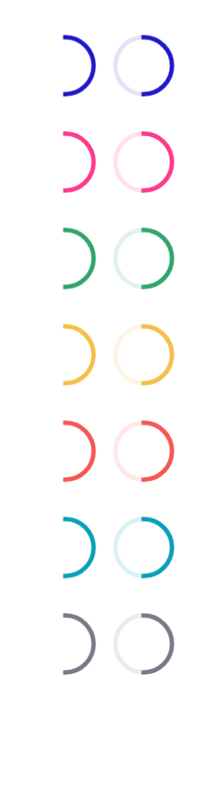

# Spinner component

## Spinner design specs

You can find the design specs
on [spark.adevinta.com](https://spark.adevinta.com/1186e1705/p/7651da-spinner/b/387bf3).

## Usage

Spinners provide a visual clue that an action is processing awaiting a course of change or a result.

### Styles

|       | Part                                                                                                                                                                            | Pro                                                                                                                                                                            |
|-------|---------------------------------------------------------------------------------------------------------------------------------------------------------------------------------|--------------------------------------------------------------------------------------------------------------------------------------------------------------------------------|
| Light |  |  |
|       |   |   |
| Dark  |   |   |
|       |    |    |

A visible background may be added to display a background behind the spinner.

All intents from Spark are available for this component ([SpinnerIntent](SpinnerIntent.kt)).
- Primary
- Secondary
- Surface
- Success
- Alert
- Danger
- Info
- Neutral

The spinner has two sizes ([SpinnerSize](SpinnerDefaults.kt)):
- Small (20.dp)
- Medium (28.dp)
