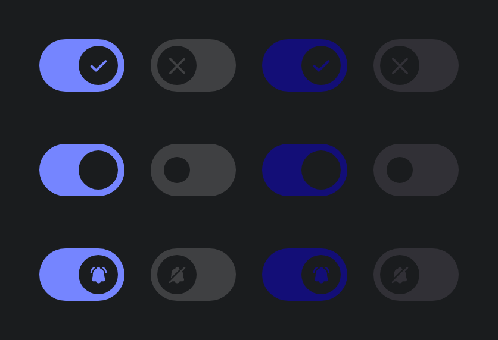

# Switch components

## Switch design specs

You can find the design specs
on [spark.adevinta.com](https://spark.adevinta.com/1186e1705/p/58a2c6-switch/b/700a17).

## Usage

Switches can be used in forms on a full page, in modals, or on side panels.
They can be used in a list but we shouldn’t mix them with other components such as checkboxes or
radio buttons.

Switches must respect the established color code and not use other colors to emphasize the
activation and deactivation of a functionality or service.

### Switch

Switch component allows the user to activate or deactivate the state of an element or concept.
It is usually used as an element to add services, activate functionalities or adjust settings.
It is also used to control binary options (On/Off or True/False).

| Light                                                                                                                                                                    | Dark                                                                                                                                                                    |
|--------------------------------------------------------------------------------------------------------------------------------------------------------------------------|-------------------------------------------------------------------------------------------------------------------------------------------------------------------------|
|  |  |

```kotlin
@Composable
public fun Switch(
    checked: Boolean,
    onCheckedChange: ((Boolean) -> Unit)?,
    modifier: Modifier = Modifier,
    enabled: Boolean = true,
    icons: SwitchIcons? = null,
    interactionSource: MutableInteractionSource = remember { MutableInteractionSource() },
)
```

| Parameters                                                                              | Descriptions                                                                                                                                                                                                                                                                                            |
|-----------------------------------------------------------------------------------------|---------------------------------------------------------------------------------------------------------------------------------------------------------------------------------------------------------------------------------------------------------------------------------------------------------|
| `checked: Boolean`                                                                      | whether or not this component is checked                                                                                                                                                                                                                                                                |
| `onCheckedChange: (() -> Unit)?`                                                        | callback to be invoked when Switch is being clicked, therefore the change of checked state is requested. If null, then this is passive and relies entirely on a higher-level component to control the "checked" state.                                                                                  |
| `modifier: Modifier = Modifier`                                                         | Modifier to be applied to the switch layout                                                                                                                                                                                                                                                             |
| `enabled: Boolean = true`                                                               | whether the component is enabled or grayed out                                                                                                                                                                                                                                                          |
| `icons: SwitchIcons? = null,`                                                           | represents the pair of icons to use for check/unchecked states, you can use [SwitchDefaults.icons] if you want to use the default ones.                                                                                                                                                                 |
| `interactionSource: MutableInteractionSource = remember { MutableInteractionSource() }` | the [MutableInteractionSource] representing the stream of [Interaction]s for this RadioButton. You can create and pass in your own remembered [MutableInteractionSource] if you want to observe [Interaction]s and customize the appearance / behavior of this RadioButton in different [Interaction]s. |

If either `checkedIcon` or ùncheckedIcon` are `null`, both icons are not rendered. You have pass two icons to have icons rendered.
---

### SwitchLabelled

| Light                                                                                                                                                                            | Dark                                                                                                                                                                            |
|----------------------------------------------------------------------------------------------------------------------------------------------------------------------------------|---------------------------------------------------------------------------------------------------------------------------------------------------------------------------------|
|  |  |

The minimal usage of the component is a standalone checkbox but you can add a label
using [SwitchLabelled].
Please refer to design specs to find what content is accepted.

- An icon can be added on the left or right of label.
- A caption can be added in different positions of the label in order to to expand the information.

```kotlin
var checked by remember { mutableStateOf(false) }
SwitchLabelled(
    checked = checked,
    onCheckedChange = {
        checked = !checked
    }
) { Text(text = "Switch On") }
```

```kotlin
@Composable
public fun SwitchLabelled(
    checked: Boolean,
    onCheckedChange: ((Boolean) -> Unit)?,
    modifier: Modifier = Modifier,
    enabled: Boolean = true,
    icons: SwitchIcons? = null,
    interactionSource: MutableInteractionSource = remember { MutableInteractionSource() },
    contentSide: ContentSide = ContentSide.Start,
    content: @Composable RowScope.() -> Unit,
)
```

| Parameters                                                                              | Descriptions                                                                                                                                                                                                                                                                                            |
|-----------------------------------------------------------------------------------------|---------------------------------------------------------------------------------------------------------------------------------------------------------------------------------------------------------------------------------------------------------------------------------------------------------|
| `checked: Boolean`                                                                      | whether or not this component is checked                                                                                                                                                                                                                                                                |
| `onCheckedChange: (() -> Unit)?`                                                        | callback to be invoked when Switch is being clicked, therefore the change of checked state is requested. If null, then this is passive and relies entirely on a higher-level component to control the "checked" state.                                                                                  |
| `modifier: Modifier = Modifier`                                                         | Modifier to be applied to the switch layout                                                                                                                                                                                                                                                             |
| `enabled: Boolean = true`                                                               | whether the component is enabled or grayed out                                                                                                                                                                                                                                                          |
| `icons: SwitchIcons? = null,`                                                           | represents the pair of icons to use for check/unchecked states, you can use [SwitchDefaults.icons] if you want to use the default ones.                                                                                                                                                                 |
| `interactionSource: MutableInteractionSource = remember { MutableInteractionSource() }` | the [MutableInteractionSource] representing the stream of [Interaction]s for this RadioButton. You can create and pass in your own remembered [MutableInteractionSource] if you want to observe [Interaction]s and customize the appearance / behavior of this RadioButton in different [Interaction]s. |
| `content: @Composable RowScope.() -> Unit`                                              | The content displayed before the switch, usually a Text composable shown at the start                                                                                                                                                                                                                   |

## Layout

- The Switch respects the minimum touch size.
- Switch labels can be positioned at the Left or the Right, but usually the left position is more
  often used on small screens and mobile devices.

### SwitchGroup

> 🚀 TODO
> We plan to provide a layout composable to make it easier to follow the design specs.